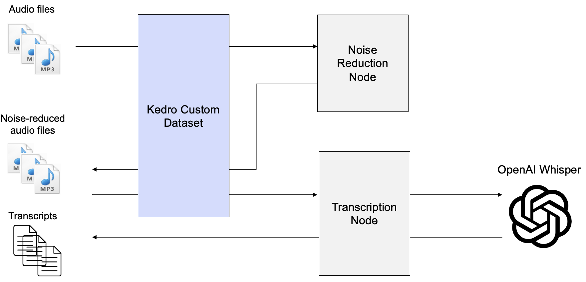

# kedro Whisper pipeline

## Overview

This is a simple kedro pipeline that shows how custom datasets can be leveraged to process and transcribe raw audio files using torchaudio.

The pipeline includes one custom dataset class `AudioDataSet` and two nodes as shown in the image below:



## Get Started

1. Clone repository
2. Create new conda environment
```
conda create -n audio_pipeline python=3.10
conda activate audio_pipeline
```
3. Install dependencies
```
pip install -r requirements.txt
```
4. Make sure that [ffmpeg](https://formulae.brew.sh/formula/ffmpeg) and [ffmpeg-python](https://pypi.org/project/ffmpeg-python/) are installed on your machine
5. Create an .env file that contains following value:
```
OPENAI_API_KEY= # your API key
```
6. Put `.mp3` audio files that should be processed into directory `data/01_raw`
7. Modify Whisper parameters in file  `conf/base/parameters.yml` according to your needs
7. Run pipeline
```
kedro run
```

Kedro then runs the pipeline and executes following steps:
1. Load audio files located in `01_raw`
2. Reduce noise in audios by running node `int_reduce_noise`
3. Save audio files with reduced noise to `05_model_input`
4. Transcribe audios with OpenAI Whisper by running node `pri_transcription`
5. Save transcripts to `07_model_output`